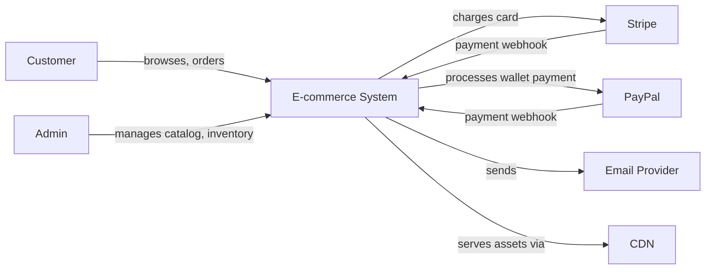
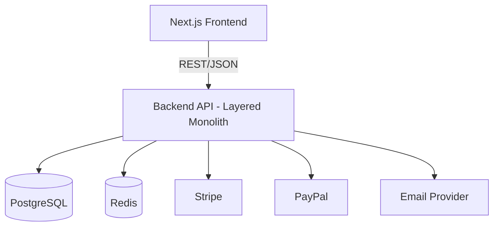
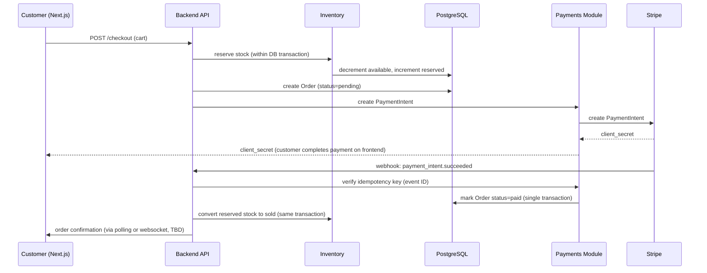
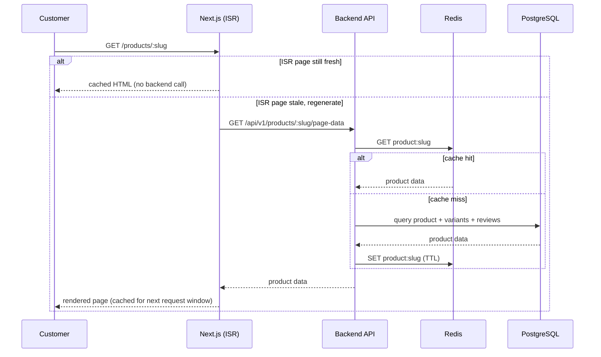
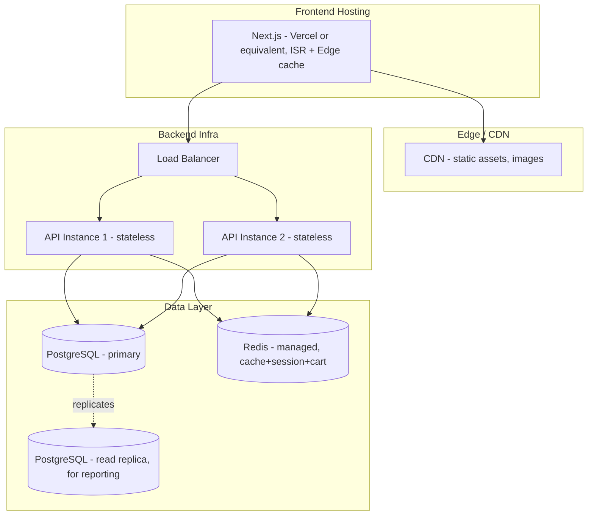

# System Architecture Report — base_server E-commerce Platform

**Scope:** Next.js frontend + Express/TypeScript backend architecture using `base_server`, with engineering, operations, DX, infra, and UX considerations documented through the provided arc42-style sections and ADRs.

---

## 1. Introduction & Goals

*(arc42 Section 1 — Requirements Overview, Quality Goals, Stakeholders)*
*Source: `01-introduction-and-goals.md`*

### 1.1 Requirements Overview

We are architecting a single-vendor e-commerce store:

- One seller, one catalog — no multi-tenant marketplace complexity.
- Backend built on top of the existing `base_server` scaffold (Express + TypeScript, layered Router → Controller → Service → Repository → Model).
- Frontend built with **Next.js**.
- International customers, card + digital-wallet payments (Stripe primary, PayPal as a secondary method).
- Explicit purpose: **realistic production-scale simulation** — not a toy CRUD demo. We must reason about real load, caching, and horizontal scaling, even though actual traffic will be simulated.

Core feature domains (to be broken down into Building Blocks in a later section): Product Catalog, Cart, Checkout, Orders, Payments, Inventory, User Accounts, Admin Dashboard, Search & Discovery, Notifications.

### 1.2 Quality Goals

arc42 recommends picking 3–5 *ranked* quality goals — not a wishlist of everything. Ranked by priority for this system:

| # | Quality Goal | Motivation |
|---|---|---|
| 1 | **Data Integrity / Reliability** | Money and stock must never go inconsistent — no double-charging, no overselling inventory, no lost payment confirmations. This is the single most expensive failure mode in e-commerce. |
| 2 | **Performance & Scalability** | Explicitly stated as the project's purpose — must design for caching, read-heavy catalog traffic, and horizontal scaling from day one, not bolt it on later. |
| 3 | **Security** | Handles payment flows (PCI-relevant scope even when delegated to Stripe) and user credentials. |
| 4 | **Maintainability** | Solo developer, learning project — code must stay understandable and extensible without a team around to compensate for tangled design. |
| 5 | **Usability (storefront speed & checkout friction)** | Directly affects conversion; slow product pages or a confusing checkout are functional failures even if the code "works." |

> Every architecture decision from here on should be checked against this ranked list — if a decision improves goal #5 but weakens goal #1, that is a red flag, not a free win.

### 1.3 Stakeholders

| Stakeholder | Concern |
|---|---|
| Store Owner (business role) | Revenue, conversion, order accuracy, low operating cost |
| End Customer | Fast browsing, trustworthy checkout, reliable order status |
| Developer (Umair — sole builder & maintainer) | Understandable codebase, realistic engineering practice, ability to extend without rewriting |
| Payment Provider (Stripe / PayPal — external) | Correct webhook handling, PCI-scope boundaries respected |
| Future maintainer (future-Umair, or anyone who inherits this code) | Documentation must explain *why*, not just *what* |

---

## 2. Constraints

*(arc42 Section 2 — Technical and Organizational Constraints)*
*Source: `02-constraints.md`*

### 2.1 Technical Constraints

| Constraint | Reason |
|---|---|
| Backend must build on the existing `base_server` scaffold (Express + TypeScript, layered architecture, existing auth/middleware patterns) | Given starting point — not a free technology choice for the HTTP/framework layer. |
| Frontend must be Next.js | Given, non-negotiable. |
| Payments via Stripe (primary) and PayPal (secondary) | Given target market is international; both are the industry-standard processors for card + wallet payments outside a specific local market. |
| Single currency at launch (assume USD) | Multi-currency (FX rates, rounding, display formatting per locale) is a real feature, not a default — introducing it without a stated requirement would be scope creep. Flagged here as an explicit, deliberate scope boundary, not an oversight. |

### 2.2 Organizational Constraints

| Constraint | Reason |
|---|---|
| Solo developer, no dedicated DevOps/SRE/DBA | Every operational decision (databases, caching, deployment) must be realistically operable by one person — this rules out architectures that assume a platform team. |
| Learning project, no hard external deadline | Allows iterative, section-by-section documentation (this doc itself) rather than a rushed, single-pass design. |
| "Production-scale simulation," not literal hyperscale | Scaling and caching decisions should be justified against a realistic mid-size store's growth path (thousands–low millions of monthly visits), not Amazon-scale assumptions. Designing for imaginary Amazon-scale load would itself be a violation of YAGNI. |

### 2.3 Conventions

- Architecture discussion and reasoning happens in Roman Urdu (working language between developer and this document's author).
- The document artifacts themselves (this file, ADRs, diagrams) are written in English, since that is the standard for architecture documentation that might be shared, referenced, or read by others later.
- Format: Markdown, arc42-structured, kept as docs-as-code (versionable alongside the eventual code repo).
- Individual significant decisions are recorded separately as ADRs under `/adr`, referenced from the relevant arc42 section rather than duplicated inline.

---

## 3. Context & Scope

*(arc42 Section 3 — Business and Technical Context, External Interfaces)*
*Source: `03-context-and-scope.md`*

### 3.1 Business Context

| Actor | Interaction |
|---|---|
| **Customer** | Browses catalog, manages cart, checks out, tracks orders |
| **Store Owner / Admin** | Manages products, inventory, views orders and sales reports |
| **Stripe** | Card payment processing, Payment Intents, webhooks for payment confirmation |
| **PayPal** | Secondary wallet payment method |
| **Email Provider** (e.g. SendGrid/SES) | Order confirmation, shipping updates, password reset |
| **CDN** | Serves static assets and product images |



### 3.2 Technical Context

| Interface | Protocol | Direction |
|---|---|---|
| Customer/Admin ↔ Next.js Frontend | HTTPS | Bidirectional |
| Next.js Frontend ↔ Backend API | HTTPS/REST/JSON | Bidirectional |
| Backend ↔ Stripe | HTTPS/REST (outbound), Webhook (inbound) | Bidirectional |
| Backend ↔ PayPal | HTTPS/REST (outbound), Webhook (inbound) | Bidirectional |
| Backend ↔ PostgreSQL | TCP/SQL | Backend-initiated |
| Backend ↔ Redis | TCP/RESP | Backend-initiated |
| Backend → Email Provider | HTTPS/REST (fire-and-forget, as in `base_server`'s existing email pattern) | Outbound only |

> **Note:** Webhooks (Stripe/PayPal → Backend) are the one interface where the *external* system initiates contact — this is the interface most likely to need retry/idempotency handling (see [08-crosscutting-concepts.md](#8-crosscutting-concepts)).

---

## 4. Solution Strategy

*(arc42 Section 4 — Fundamental decisions and solution approaches)*
*Source: `04-solution-strategy.md`*

### 4.1 Technology Decisions

*(summary — full reasoning in `/adr`)*

| Layer | Choice | ADR |
|---|---|---|
| Backend framework | Express + TypeScript, layered (`base_server` foundation) | — (given constraint) |
| Database (core) | PostgreSQL | ADR-0001 |
| Cache/Session/Cart | Redis | ADR-0001 |
| API style | REST, versioned, composite read endpoints | ADR-0002 |
| Search | PostgreSQL full-text (`tsvector`) | ADR-0003 |
| Frontend | Next.js (SSR + ISR) | given constraint |
| Payments | Stripe (primary) + PayPal (secondary) | given constraint |

### 4.2 How Each Quality Goal Is Addressed

| Quality Goal | Strategy |
|---|---|
| **Data Integrity** | PostgreSQL ACID transactions wrap order creation + inventory decrement as a single atomic unit. Payment webhooks are processed idempotently (idempotency key stored per Stripe/PayPal event ID) so retried webhooks never double-apply. |
| **Performance & Scalability** | Redis cache-aside for product reads (short TTL, invalidated on product update). Next.js ISR for storefront pages (regenerate on a timer, not on every request). Backend API kept stateless (session data in Redis, not in-process) so it can scale horizontally behind a load balancer. |
| **Security** | Card data never touches our servers — Stripe/PayPal handle PCI-scoped data via hosted fields/redirect flows. Auth reuses `base_server`'s httpOnly + secure + sameSite cookie pattern. Rate limiting moves from Mongo-backed to Redis-backed and is applied to *all* auth and checkout endpoints (fixing the gap found during the `base_server` review). |
| **Maintainability** | Layered structure preserved from `base_server` (Router → Controller → Service → Repository). Every non-obvious decision is captured as an ADR instead of living only in someone's memory. |
| **Usability** | Next.js ISR keeps product pages fast without full SSR cost on every request; composite REST endpoints (ADR-0002) avoid multi-round-trip loading spinners on key pages. |

### 4.3 Top-Level Approach

The system stays a **layered monolith** (not microservices) — a single deployable backend, internally organized into clear domain modules (Catalog, Cart, Checkout/Orders, Payments, Inventory, Auth, Admin, Notifications, Search).

This is a deliberate choice: a single-vendor store at the stated scale does not have independent-team or independent-scaling needs that would justify microservices' operational cost (same YAGNI reasoning applied throughout this document). If a specific module (e.g., Search, or image processing) later needs independent scaling, it can be extracted later — the layered internal structure makes that extraction easier, not harder.

---

## 5. Building Block View

*(arc42 Section 5 — Structure of the system, hierarchically refined. Usually the most extensive section.)*
*Source: `05-building-block-view.md`*

### 5.1 Level 1 — Whitebox Overall System



### 5.2 Level 2 — Backend Domain Modules

Each module follows `base_server`'s existing pattern: `Router → Controller → Service → Repository → Model`.

| Module | Responsibility |
|---|---|
| **Auth** | Registration, login, logout, token refresh, password reset (reused from `base_server`, re-pointed at PostgreSQL) |
| **Catalog** | Products, categories, variants, images (metadata; actual images on CDN) |
| **Cart** | Cart lines, stored in Redis (short-lived, high-write, doesn't need relational durability) |
| **Checkout/Orders** | Order creation, order status lifecycle, ties cart → payment → inventory together |
| **Payments** | Stripe/PayPal integration, webhook handlers, idempotency ledger |
| **Inventory** | Stock levels, reservation during checkout, decrement on confirmed payment |
| **Admin** | Product/category management, order management, sales reporting (relational joins across Orders/Products/Users) |
| **Notifications** | Order confirmation, shipping update, password-reset emails (fire-and-forget, as in `base_server`) |
| **Search** | Product search via PostgreSQL full-text (`tsvector`) — see ADR-0003 |

### 5.3 Folder Structure

*(extending `base_server`'s existing convention)*

```
src/
  APIs/
    catalog/          (products, categories, variants)
    cart/              (Redis-backed, no repository layer needed)
    checkout/          (orchestrates cart + payments + inventory)
    payments/          (Stripe/PayPal adapters, webhook handlers)
    inventory/
    user/
      authentication/   (reused from base_server, repo swapped to Prisma)
      management/        (now actually implemented — was a stub in base_server)
    admin/
    notifications/
    search/
    _shared/            (shared types, DB client instance, common middlewares)
  middlewares/          (authenticate, rateLimiter [now Redis-backed], errorHandler)
  services/              (database, redis, email, stripe-client, paypal-client)
```

This is a direct extension of `base_server`'s file-structure convention (as documented in the earlier code review) — not a rewrite of the pattern, only a repository-layer swap and new sibling modules alongside the existing `user` module.

---

## 6. Runtime View

*(arc42 Section 6 — Key runtime scenarios)*
*Source: `06-runtime-view.md`*

### 6.1 Scenario: Checkout & Payment



**Key design point:** stock reservation happens *before* payment confirmation (to prevent overselling during the payment gap), and is converted to a permanent decrement only inside the same transaction that marks the order paid. If payment fails or times out, a scheduled job releases reserved stock back to available (see [11. Risks & Technical Debt](#11-risks--technical-debt) — this reconciliation job is a real piece of work, not automatic).

### 6.2 Scenario: Product Page Read (cache-aside)



---

## 7. Deployment View

*(arc42 Section 7 — Hardware, infrastructure, deployment)*
*Source: `07-deployment-view.md`*



| Node | Notes |
|---|---|
| **Next.js hosting** | Chosen for its native ISR/edge-cache support, directly serving the Performance quality goal. |
| **Backend API instances** | Kept **stateless** deliberately — no in-memory session/cart state — so horizontal scaling is just "add another instance behind the load balancer," no sticky sessions needed. |
| **PostgreSQL primary + read replica** | Reporting/admin queries (sales dashboards) run against the replica so they never compete with checkout-path writes for connections. |
| **Redis** | Single managed instance to start; a solo-developer constraint (2.2) rules out running a self-managed Redis cluster from day one. Documented as a scaling lever, not a day-one requirement. |
| **Docker** | `base_server` already ships dev/prod Dockerfiles — reused as the containerization baseline for the API instances. |

> Deliberately deferred (not needed at current stated scale): container orchestration (Kubernetes), multi-region deployment, database sharding. Introducing these now, for a single-vendor store's stated scale, would repeat the same YAGNI mistake flagged in ADR-0001 for the database.

---

## 8. Crosscutting Concepts

*(arc42 Section 8 — Overarching technical topics that recur across modules)*
*Source: `08-crosscutting-concepts.md`*

| Concept | Approach |
|---|---|
| **Authentication** | JWT access + refresh tokens in httpOnly/secure/sameSite cookies — reused from `base_server` as-is; this pattern was already sound in the original review. |
| **Authorization** | Role check middleware (Customer vs Admin) applied per-route, extending `base_server`'s existing `authenticate` middleware. |
| **Error Handling** | Centralized error middleware + `errorObject` builder, reused from `base_server`. **Fix applied:** the original codebase's redundant per-controller try/catch (on top of `asyncHandler` already forwarding to `next()`) is removed — one mechanism, not two, per the DRY finding from the earlier code review. |
| **Validation** | Joi schemas per-request, reused from `base_server`'s pattern. |
| **Rate Limiting** | Moved from Mongo-backed to **Redis-backed** (ADR-0001 already justifies Redis's presence). Applied to **all** auth and checkout endpoints — closing the gap found in the original `base_server` review, where only `/self` was protected. |
| **Caching** | Cache-aside pattern via Redis for catalog reads; explicit invalidation on product/inventory update (not just TTL expiry, to avoid serving stale stock counts). |
| **Idempotency** | Payment webhooks (Stripe/PayPal) are keyed by their event ID in a dedicated idempotency table — a retried webhook is a no-op, not a duplicate order update. This is the single most important crosscutting concern in the whole system, directly protecting the #1 quality goal (Data Integrity). |
| **Logging & Observability** | Winston (reused from `base_server`) extended with a **request-correlation ID** attached at the edge and propagated through service calls — this closes the observability gap flagged in the original review, where no request tracing existed. |
| **API Versioning** | `/api/v1/...` prefix from day one, so breaking changes later don't require a big-bang migration. |
| **Security Headers/CORS** | `helmet` + CORS reused from `base_server`, with the CORS origin now read from environment config instead of the hardcoded placeholder found during the review. |

---

## 9. Architecture Decisions

*(arc42 Section 9 — Important, expensive, risky, or contentious decisions. Full detail lives in `/adr` as individual Architecture Decision Records; this section is the index.)*
*Source: `09-architecture-decisions.md`*

| ADR | Decision | Why it matters |
|---|---|---|
| [0001](./adr/0001-database-choice.md) | PostgreSQL + Redis, deviating from `base_server`'s default MongoDB | Highest-impact deviation from the given scaffold; protects the #1 quality goal (Data Integrity). Requires re-implementing `base_server`'s auth/user module against the new store. |
| [0002](./adr/0002-api-style.md) | REST over GraphQL, with composite read endpoints | Directly serves the caching/scalability quality goal; keeps `base_server`'s existing routing pattern intact. |
| [0003](./adr/0003-search-technology.md) | PostgreSQL full-text search over Elasticsearch | Avoids adding a fourth infrastructure piece the stated scale doesn't justify. |

New ADRs should be added here as future contentious decisions arise (e.g., if the business later asks for multi-currency, multi-vendor, or a dedicated search engine) — each gets its own file in `/adr`, numbered sequentially, never edited retroactively once accepted (a superseding decision gets a *new* ADR that references the old one).

---

## 10. Quality Requirements

*(arc42 Section 10 — Detailed quality scenarios, linked to the ranked goals in Section 1)*
*Source: `10-quality-requirements.md`*

| # | Quality Attribute | Scenario | Stimulus | Expected Response |
|---|---|---|---|---|
| 1 | Data Integrity | Two customers try to buy the last unit of a product simultaneously | Concurrent checkout requests hit the same SKU | Only one order succeeds in reserving the final unit; the other is told "out of stock" before payment is attempted — never after a customer is charged |
| 1 | Data Integrity | Stripe redelivers a webhook (network retry) | Duplicate `payment_intent.succeeded` event received | Order is marked paid exactly once; no duplicate confirmation email, no double inventory decrement |
| 2 | Performance | Product page requested during a traffic spike (e.g., a sale event) | 10x normal request volume on top product pages | Served from Next.js ISR cache / Redis cache-aside — database load stays flat, not proportional to traffic |
| 2 | Scalability | Sustained increase in checkout volume | Backend CPU/connection saturation on existing instances | New stateless API instance added behind the load balancer with no code change and no session-affinity issues |
| 3 | Security | Attacker attempts credential-stuffing against login | Repeated failed login attempts from one IP/account | Redis-backed rate limiter blocks further attempts after threshold, on the login endpoint specifically (the gap found in the original `base_server` review) |
| 4 | Maintainability | New developer joins and needs to add a "wishlist" feature | Requirement to add a new domain module | Can be added as a new `src/APIs/wishlist/` module following the existing Router→Controller→Service→Repository convention, without touching unrelated modules |
| 5 | Usability | Customer opens a product page on mobile with average connection | Page load request | First meaningful content visible without waiting on a live database round-trip (served via ISR) |

---

## 11. Risks & Technical Debt

*(arc42 Section 11 — Known problems, risks, and technical debt, with mitigation notes)*
*Source: `11-risks-and-technical-debt.md`*

| Risk | Likelihood/Impact | Mitigation |
|---|---|---|
| **Mongo → PostgreSQL migration effort underestimated** | High impact | `base_server`'s auth module is not a drop-in reuse under ADR-0001 — this should be the *first* implementation task, scheduled and time-boxed on its own, not discovered mid-build. |
| **Partial failure between payment and inventory** (payment succeeds, but the inventory-decrement step fails due to a crash or bug) | Medium likelihood, high impact | Needs a reconciliation job that periodically checks for orders marked "paid" whose inventory step never completed, and completes or flags them. This is real work not yet designed in detail — flagged here deliberately rather than assumed away. |
| **Stuck reserved stock** (customer abandons checkout after reservation, before payment) | Medium likelihood, medium impact | Needs a scheduled job to release reservations older than a timeout window back to available stock. Not yet designed. |
| **Single-currency assumption (2.1)** | Low likelihood now, high rework if it changes | If international expansion later needs multi-currency, this touches Pricing, Orders, and Reporting simultaneously — worth revisiting early if there's any signal this is coming, rather than late. |
| **Solo-developer bus factor** | Structural, not a "bug" | This document itself is the main mitigation — decisions and reasoning are written down so the system remains maintainable even if memory fades or someone else eventually joins. |
| **Redis as a single managed instance (7)** | Low likelihood, medium impact | Cache-aside means a Redis outage degrades performance (falls back to DB) rather than causing an outage — but cart and session data living only in Redis means a Redis loss *does* lose active carts/sessions. Worth an explicit decision later on whether cart durability matters enough to also persist it. |
| **No load testing performed** | Certain gap at this stage | All "production-scale" reasoning here is design-time analysis, not measured. Before treating any capacity number as real, actual load testing against the built system is required — this document reasons about scale, it does not prove it. |

---

## 12. Glossary

*(arc42 Section 12 — Domain and technical terms)*
*Source: `12-glossary.md`*

| Term | Definition |
|---|---|
| **SKU** | Stock Keeping Unit — a unique identifier for a specific sellable product variant (e.g., "T-Shirt, Red, Medium"). |
| **ADR** | Architecture Decision Record — a short document capturing one significant decision: context, options, decision, consequences. |
| **Idempotency Key** | A unique value attached to an operation (e.g., a Stripe event ID) so that repeating the operation has no additional effect beyond the first time. |
| **Cache-aside** | A caching pattern where the application checks the cache first; on a miss, it reads from the database and writes the result into the cache for next time. |
| **ISR (Incremental Static Regeneration)** | A Next.js feature that serves a pre-rendered page and regenerates it in the background after a set interval, rather than rendering fresh on every request. |
| **Webhook** | An HTTP callback that an external service (Stripe/PayPal) sends to our backend when an event happens on their side (e.g., a payment succeeding). |
| **PCI Scope** | The part of a system that touches raw card data and must comply with Payment Card Industry security standards. Delegating this to Stripe/PayPal keeps our own servers out of PCI scope. |
| **Stock Reservation** | Temporarily holding inventory for a customer during checkout, before payment is confirmed, to prevent overselling. |
| **Layered Monolith** | A single deployable application whose internal code is organized into horizontal layers (e.g., Router → Controller → Service → Repository), as opposed to being split into independently deployable microservices. |

---

## ADR-0001: Database Choice for Transactional Core

*Source: `0001-database-choice.md`*

**Status:** Recommended (pending your confirmation — this is a deliberate deviation from `base_server`'s default)

### Context

`base_server` ships with MongoDB via Mongoose as its default persistence layer. Our top-ranked quality goal (see [Section 1](#1-introduction--goals)) is Data Integrity: orders must never double-charge a customer, inventory must never be oversold, and payment records must never be lost or duplicated. Our #2 goal is Performance & Scalability, which explicitly calls for reasoning about caching.

The project is confirmed single-vendor (not a multi-tenant marketplace), which matters: it limits how much schema flexibility we actually need for the catalog, and rules out justifying heavy polyglot infrastructure on "future multi-tenant" grounds.

### Options Considered

**A. Keep pure MongoDB (`base_server`'s default)**
- (+) Zero migration effort from the given scaffold; Mongoose already familiar.
- (+) Flexible schema, convenient for product variants (size/color/attributes).
- (–) Multi-document ACID transactions exist since MongoDB 4.0 but are heavier and less idiomatic than relational transactions for money-critical flows (order create + stock decrement + payment record, all-or-nothing).
- (–) Cross-entity reporting (sales by day, best-sellers, revenue by category) requires aggregation pipelines that get complex fast compared to SQL joins.

**B. Full polyglot: MongoDB (catalog) + PostgreSQL (orders/payments) + Redis (cache)**
- (+) "Best tool for each job" in theory.
- (–) Three data stores to operate, back up, and monitor, for a *single-vendor* store — this is disproportionate operational complexity for a solo developer. It directly violates the YAGNI/KISS principles we established earlier: the multi-tenant catalog flexibility that would justify a separate document store isn't a real requirement here.

**C. PostgreSQL as the single source of truth (JSONB columns for flexible product attributes) + Redis for caching/sessions/cart**
- (+) ACID guarantees exactly where they matter most: Orders, Payments, Inventory.
- (+) Mature relational reporting for the business-facing side (sales, inventory, revenue queries).
- (+) JSONB columns give most of Mongo's schema flexibility for product variants without a second database engine.
- (+) Redis is directly justified by the explicitly stated need to reason about caching — cache-aside for product reads, session storage, cart storage, and can also replace `base_server`'s current Mongo-backed rate limiter with a faster, more standard Redis-backed one.
- (–) Real rework required: `base_server`'s existing Mongoose-based user/auth module needs to be re-implemented against PostgreSQL (via Prisma or TypeORM) — this is not a free change.
- (–) Loses some of Mongo's "just add a field" convenience for genuinely unstructured data (mitigated by JSONB where it's actually needed).

### Decision

**Option C.** PostgreSQL for the transactional core (Users, Products, Orders, OrderItems, Payments, Inventory, Addresses), with JSONB for flexible product attributes, plus Redis for caching, sessions, cart, and rate-limiting.

This is a conscious deviation from `base_server`'s shipped MongoDB default. The Router → Controller → Service layering pattern from `base_server` is kept; only the Repository/Model layer's underlying engine changes.

### Consequences

- **Positive:** Strong consistency exactly where money and stock are involved; simpler single-database operations (one primary store to manage, not three); Redis gives genuine, justified caching rather than caching bolted on as an afterthought.
- **Negative:** The existing `base_server` auth/user Mongoose code needs re-implementation, not reuse as-is. This is real, non-trivial migration work that should be scheduled as an explicit early task, not discovered mid-build.
- **Revisit if:** the business later needs a genuine multi-vendor marketplace with wildly varying per-seller product schemas — at that point, re-evaluating a document store for the catalog specifically becomes justified again.

---

## ADR-0002: API Style — REST vs GraphQL

*Source: `0002-api-style.md`*

**Status:** Recommended

### Context

The storefront (Next.js) is read-heavy: product listings, product detail pages, and category pages dominate traffic and directly benefit from HTTP-level caching (CDN edge caching, browser cache, `Cache-Control`/`ETag` headers, and Next.js ISR). Admin and checkout flows are comparatively write-heavy and lower-volume. Our #2 quality goal explicitly requires reasoning about caching and scaling.

`base_server` is already built as a REST-style layered app (Router → Controller → Service).

### Options Considered

**REST**
- (+) Native HTTP caching semantics work out of the box with CDNs and browsers — directly serves the caching/scaling quality goal.
- (+) Zero rework of `base_server`'s existing routing/controller pattern.
- (+) Pairs naturally with Next.js `fetch` + ISR (Incremental Static Regeneration) for product pages.
- (–) Risk of over-fetching/under-fetching for complex nested views (e.g., a product page needing product + reviews + related items in one round trip).

**GraphQL**
- (+) Flexible querying, single endpoint, avoids over/under-fetching for complex nested UI.
- (–) Typically served over a single `POST` endpoint — much harder to cache at the CDN/HTTP layer; requires extra caching infrastructure (persisted queries, Apollo/Mercurius-level caching) to get back what REST gives for free.
- (–) Added operational and learning surface not justified by a single-vendor storefront's actual query complexity — this is the same YAGNI concern as the polyglot-database option in ADR-0001.

### Decision

**REST**, with resource-based, versioned endpoints (`/api/v1/...`), plus a small number of deliberately composite, purpose-built read endpoints for complex pages (e.g., `GET /api/v1/products/:slug/page-data` returning product + reviews + related items together) — this avoids GraphQL's operational cost while still avoiding REST's classic multi-round-trip problem for the few views that need it.

### Consequences

- **Positive:** Full alignment with `base_server`'s existing foundation (no rework); CDN/HTTP caching is available immediately, directly serving the stated scaling goal; simpler for a solo developer to reason about and operate.
- **Negative:** Composite endpoints must be designed deliberately per-view rather than relying on generic CRUD — this is a small ongoing design discipline, not a one-time cost.

---

## ADR-0003: Search Technology

*Source: `0003-search-technology.md`*

**Status:** Recommended

### Context

The Search module needs to let customers find products by name/description/category. Options range from a dedicated search engine to using the primary database's built-in text search.

### Options Considered

**A. Elasticsearch (or similar dedicated search engine)**
- (+) Best-in-class relevance ranking, fuzzy matching, faceted search.
- (–) A fourth infrastructure piece to operate (on top of Postgres, Redis, and the API) for a *single-vendor* catalog that is not large. This repeats the same over-engineering pattern rejected in ADR-0001 for the database.

**B. PostgreSQL full-text search (`tsvector`/`tsquery`, optionally `pg_trgm` for fuzzy matching)**
- (+) No new infrastructure — already have PostgreSQL as the primary store (ADR-0001).
- (+) Sufficient relevance and fuzzy-matching quality for a single-vendor catalog of realistic size (hundreds to low thousands of SKUs, not millions).
- (–) Ranking/relevance features are less sophisticated than a dedicated engine at very large scale.

### Decision

**Option B.** PostgreSQL full-text search, with a `tsvector` column indexed (GIN index) on product name/description/category, plus `pg_trgm` for typo-tolerant matching.

### Consequences

- **Positive:** Zero additional infrastructure; consistent with the "single data store for the core, Redis only for caching" strategy from ADR-0001.
- **Negative:** If the catalog later grows dramatically or relevance quality becomes a real business complaint, this decision should be revisited — Elasticsearch becomes justified once the scale/quality trade-off actually shows up, not before.

---

## Architecture Diagrams Appendix

The following diagrams supplement the architecture sections above. Original source files remain unchanged.

- **D1.** High-Level System Architecture — *Figure 1*
- **D2.** Checkout Flow — *Figure 2*
- **D3.** Stripe/PayPal Webhook Idempotency Flow — *Figure 3*
- **D4.** Inventory Reservation & Release Flow — *Figure 4*
- **D5.** Order State Machine — *Figure 5*
- **D6.** Product Read Cache-Aside & Invalidation Flow — *Figure 6*
- **D7.** Deployment & Horizontal Scaling Topology — *Figure 7*

> Original diagram images were referenced in the source document but not included in the provided text; slot them in here (``) once available.
